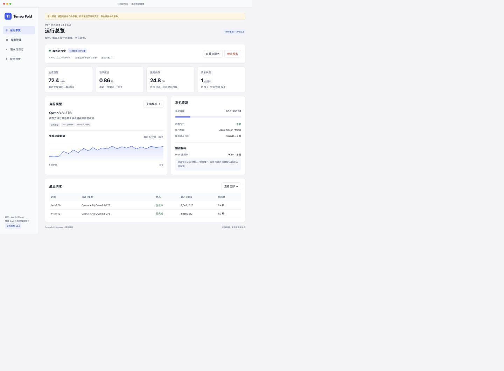

# TensorFold Manager

独立 macOS App 中的 Web 管理界面，面向 [TensorFold](https://github.com/ashhart/TensorFold) 本地推理服务。

**阶段：交互原型与需求审核，尚未实现服务控制或发布可安装 App。**

## 原型

打开 `prototype/index.html` 即可查看。无构建依赖，无网络请求，所有数据与操作均为模拟。

四个页面：运行总览、模型管理、请求与日志、服务设置。覆盖服务启动/停止/重启、模型切换确认、运行指标、日志、启动失败说明和引擎升级策略。

## 已确定约束

- 独立 macOS App，内置 Web 管理界面。
- 原型确认后实施；使用 Superpowers 规划与 grill-me 审核关键决策。
- 项目代码在 GitHub 公开同步。
- 必须高效跟随上游升级，避免维护侵入式核心修改。
- 参考本机 oMLX 的管理功能，采用自主设计，不复制其代码或资源。

## 架构建议（待审核）

推荐：桌面 App → 独立管理层 → 版本适配器 → 原版 TensorFold 引擎。

管理层独立存活，负责进程生命周期、配置、状态与日志；停止推理引擎后界面仍可使用。考虑以稳定 API 网关接收客户端请求，以便统计请求、停止接收新请求和在模型切换时排空在途请求。

引擎与 App 分别版本化，隔离引擎安装环境。优先从 CLI 帮助、配置检查、健康与模型接口探测能力；日志解析仅作为版本受控的补充。升级先在独立环境中验证，再激活新版本；保留上一个成功版本。CI 应维护兼容矩阵及接口样本测试，新参数按能力显示，上游未知变化明确标记未验证。安装方式、桌面壳技术、升级验证范围尚待确定。

替代方案：直接 fork 上游核心；或 UI 直接依赖引擎内部 Python 对象。前者增加合并成本，后者使上游内部变化直接影响管理界面。

## 上游能力证据

核查日期：2026-09-29；主分支源码版本报告为 0.3.6.2。实施前必须固定 commit 并再次验证，主分支可能变化。

- [CLI](https://github.com/ashhart/TensorFold/blob/main/src/tensorfold/cli.py)：serve / pull / models / info / update，启动时指定模型。
- [HTTP](https://github.com/ashhart/TensorFold/blob/main/src/tensorfold/server/http.py)：health、v1/models、completions 与 chat/completions。
- [请求处理](https://github.com/ashhart/TensorFold/blob/main/src/tensorfold/server/app.py)：completion 结果及日志包含 runtime / speculative 数据。
- 未发现运行中模型 load/unload/switch 管理接口；切换按停止旧进程、以新模型启动设计。
- 未发现独立 metrics 接口；请求计数/队列等需管理层采集，指标缺失应显示未采集。
- 不使用原始请求日志代替指标采集，正文记录策略需单独确定。

## 原型验证

- 已在真实浏览器检查 1440 px 桌面布局。
- 已点击验证模型切换确认及总览当前模型更新。
- 已点击验证停止服务确认、停止状态与管理导航继续可用。
- 这些验证仅说明原型交互有效，不代表真实服务或 App 已验收。

## 待审核

1. 引擎升级：默认手动确认 / 自动升级，兼容性验证和回退策略。
2. 切换模型与停止服务时：排空请求、等待上限、强制取消规则。
3. 首版模型来源：本地目录 / 内置下载。
4. 关闭窗口、退出 App、自动启动行为。
5. API 网关、请求记录范围与日志保留。
6. 桌面壳选择、安装发行与最终验收。

审核完成并确认原型后，编写正式设计与实施计划；当前不安装引擎、不改动本机 oMLX、不接管现有服务。
